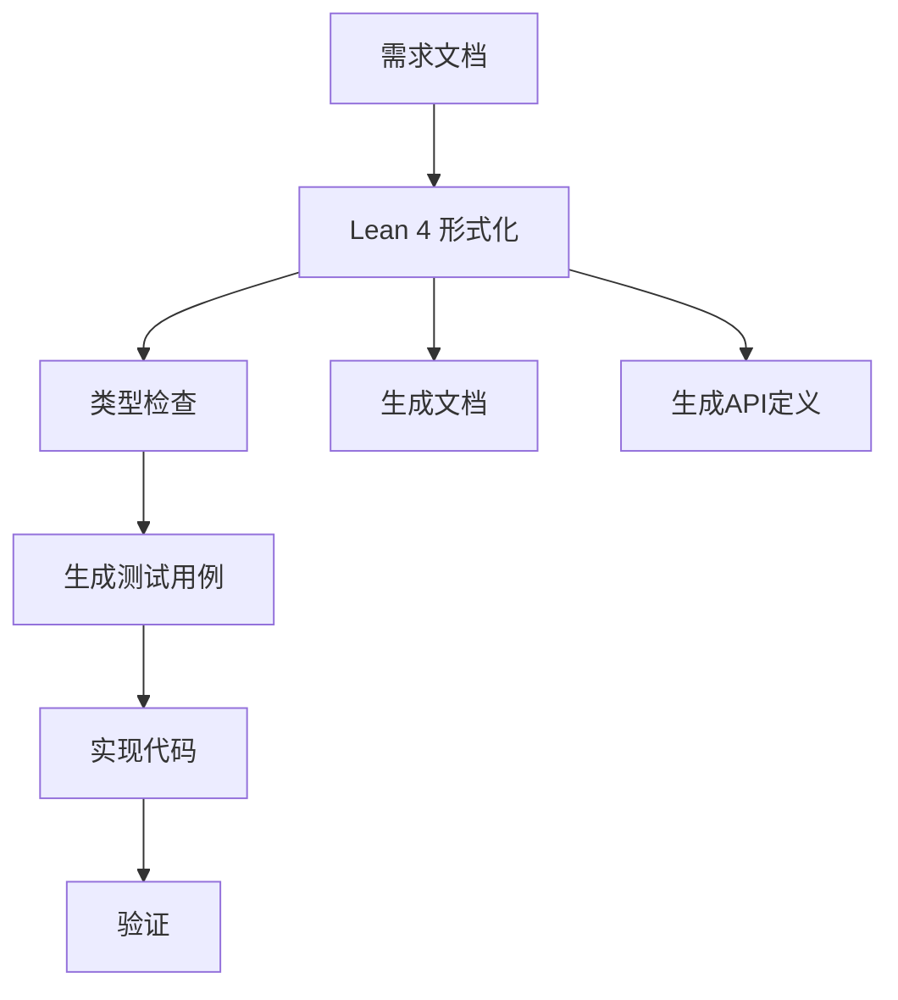

# 使用 Lean 4 形式化 CLI 需求规格说明

## 目录

1. [基础定义](#基础定义)
2. [需求描述模板](#需求描述模板)
3. [实战示例](#实战示例)
4. [验证与证明](#验证与证明)
5. [工具链集成](#工具链集成)

---

## 1. 基础定义

### 1.1 领域模型

```lean
/-- CLI 需求领域模型 -/
namespace DomainModel

  /-- 输入参数 -/
  structure CLIArguments where
    positional : List String    -- 位置参数
    options : List Option       -- 选项标志
    flags : List Flag           -- 布尔标志

  /-- 选项定义 -/
  structure Option where
    name : String              -- 选项名称
    value : String             -- 选项值
    required : Bool            -- 是否必需

  /-- 标志定义 -/
  structure Flag where
    name : String              -- 标志名称
    enabled : Bool            -- 是否启用

  /-- 执行上下文 -/
  structure ExecutionContext where
    workingDir : String        -- 工作目录
    envVars : List (String × String)  -- 环境变量
    stdin : Option String      -- 标准输入

  /-- 执行结果 -/
  inductive ExecutionResult where
    | Success : Nat                -- 成功（退出码0）
    | Failure : Nat × String      -- 失败（退出码，消息）
```

### 1.2 验证规则

```lean
/-- 验证规则 -/
namespace Validation

  /-- 验证谓词 -/
  def isValidInput (args : CLIArguments) : Prop :=
    args.positional.length >= 1 ∧  -- 至少有一个位置参数
    args.options.forAll (fun opt =>
      opt.required ∨ opt.value ≠ "")

  /-- 路径验证 -/
  def isValidPath (path : String) : Prop :=
    path.length > 0 ∧
    ¬path.contains "\000" ∧
    (path.startsWith "/" ∨
     path.startsWith "~/" ∨
     ¬path.contains "/")

  /-- 互斥选项验证 -/
  def areOptionsExclusive (opts : List Option) : Prop :=
    ∀ opt₁ opt₂ : Option,
      In opt₁ opts →
      In opt₂ opts →
        opt₁.name ≠ opt₂.name ∨
        (opt₁.name = opt₂.name ∧
         (opt₁.value.isEmpty ∧ opt₂.value.isEmpty))

  /-- 必需条件 -/
  def requiredOptionsPresent (opts : List Option) : Prop :=
    opts.filter (fun opt => opt.required)
       .forall (fun opt =>
         ∃ actual, actual.name = opt.name ∧
                     actual.value ≠ "")
```

---

## 2. 需求描述模板

### 2.1 命令行接口规格

```lean
/-- 命令行接口需求 -/
namespace CommandSpec

  structure Command where
    name : String              -- 命令名称
    description : String        -- 命令描述
    version : String           -- 版本号
    author : String            -- 作者

  structure CommandSignature where
    command : Command
    positionalArgs : List ArgSpec
    options : List OptionSpec
    flags : List FlagSpec

  /-- 参数规格 -/
  structure ArgSpec where
    name : String              -- 参数名称
    description : String        -- 描述
    required : Bool            -- 是否必需
    validator : String → Prop  -- 验证函数

  /-- 选项规格 -/
  structure OptionSpec where
    name : String              -- 选项名称（如 --output）
    shortName : Option Char    -- 短选项（如 -o）
    description : String        -- 描述
    valueName : String        -- 值名称
    required : Bool            -- 是否必需
    defaultValue : Option String  -- 默认值
    validator : String → Prop  -- 验证函数

  /-- 标志规格 -/
  structure FlagSpec where
    name : String              -- 标志名称（如 --verbose）
    shortName : Option Char    -- 短标志（如 -v）
    description : String        -- 描述
    default : Bool             -- 默认值
```

### 2.2 行为规格

```lean
/-- 行为需求规格 -/
namespace BehaviorSpec

  /-- 前置条件 -/
  structure Precondition where
    description : String
    predicate : CLIArguments → Prop

  /-- 后置条件 -/
  structure Postcondition where
    description : String
    predicate : ExecutionContext →
                 CLIArguments →
                 ExecutionResult → Prop

  /-- 不变量 -/
  structure Invariant where
    description : String
    predicate : ExecutionContext → Prop

  /-- 场景 -/
  structure Scenario where
    name : String
    given : List Precondition
    when : CLIArguments
    then : List Postcondition
```

### 2.3 完整需求示例

```lean
/-- 场景：文件复制命令 -/

namespace FileCopySpec

  /-- 场景：成功复制文件 -/
  def scenario_copy_success : Prop :=
    -- Given
    let pre1 : Precondition := {
      description := "源文件存在",
      predicate := fun args =>
        args.positional.get? 0 = some "source.txt" ∧
        System.File.exists "source.txt"
    }

    let pre2 : Precondition := {
      description := "目标路径可写",
      predicate := fun _ =>
        System.File.isWritable "target.txt"
    }

    -- When
    let input : CLIArguments := {
      positional := ["source.txt", "target.txt"],
      options := [],
      flags := []
    }

    -- Then
    let post1 : Postcondition := {
      description := "文件被复制",
      predicate := fun ctx args result =>
        result = Success 0 ∧
        System.File.exists "target.txt" ∧
        System.File.contents "target.txt" =
          System.File.contents "source.txt"
    }

    pre1 ∧ pre2 ∧ post1

  /-- 场景：源文件不存在 -/
  def scenario_source_not_found : Prop :=
    let pre : Precondition := {
      description := "源文件不存在",
      predicate := fun _ =>
        ¬(System.File.exists "nonexistent.txt")
    }

    let input : CLIArguments := {
      positional := ["nonexistent.txt", "target.txt"],
      options := [],
      flags := []
    }

    let post : Postcondition := {
      description := "返回错误",
      predicate := fun _ args result =>
        result = Failure 1 "Source file not found"
    }

    pre ∧ post
```

---

## 3. 实战示例：`emx-note` CLI 需求

```lean
/-- emx-note note 命令需求规格 -/

namespace EmxNoteSpec

  /-- 命令定义 -/
  def note_command : Command :=
    {
      name := "note",
      description := "Create permanent note",
      version := "1.0.0",
      author := "emx-note team"
    }

  /-- 签名规格 -/
  def note_signature : CommandSignature :=
    {
      command := note_command,
      positionalArgs := [
        {
          name := "title",
          description := "Note title (optional)",
          required := false,
          validator := fun title =>
            title.length > 0 ∧ title.length ≤ 100
        }
      ],
      options := [
        {
          name := "source",
          shortName := some 's',
          description := "Source identifier (URL, file path)",
          valueName := "SOURCE",
          required := false,
          defaultValue := none,
          validator := fun src =>
            src.length > 0 ∧
            (src.startsWith "http" ∨
             src.startsWith "/" ∨
             src.startsWith "~/")
        }
      ],
      flags := [
        {
          name := "verbose",
          shortName := some 'v',
          description := "Show detailed output",
          default := false
        }
      ]
    }

  /-- 场景：创建带标题的笔记 -/
  def scenario_create_note_with_title : Prop :=
    -- Given
    let pre1 : Precondition := {
      description := "Capsa 可访问",
      predicate := fun args =>
        args.options.any? (fun opt =>
          opt.name = "capsa" ∧ opt.value ≠ "")
        ∨ true  -- capsa 参数可选，有默认值
    }

    let input : CLIArguments := {
      positional := ["Meeting Notes"],
      options := [
        {
          name := "source",
          shortName := none,
          description := "",
          valueName := "",
          required := false,
          defaultValue := none,
          validator := fun _ => true
        }
      ],
      flags := [
        { name := "verbose", shortName := some 'v',
          description := "", default := false }
      ]
    }

    -- Then
    let post : Postcondition := {
      description := "笔记文件已创建",
      predicate := fun ctx args result =>
        let title := args.positional.get! 0
        result = Success 0 ∧
        ∃ notePath,
          System.File.exists notePath ∧
          (System.File.fileName notePath).startsWith
            (slugify title ++ ".md")
    }

    pre1 ∧ post

  /-- 辅助函数：slugify -/
  def slugify (s : String) : String :=
    s.toLower
      |> (fun s => s.fold "" (fun acc c =>
        if c.isAlphaNum then
          acc ++ toString c
        else if acc.length > 0 ∧
                (acc.get! (acc.length - 1) ≠ '-') then
          acc ++ "-" ++ toString c
        else
          acc
      ))
end EmxNoteSpec
```

---

## 4. 验证与证明

### 4.1 性质定理

```lean
/-- 需求验证定理 -/

namespace Theorems

  open CommandSpec BehaviorSpec

  /-- 定理理1：参数解析完整性 -/
  theorem argument_parsing_completeness :
    ∀ {cmd : Command} {args : CLIArguments},
      parseCommand cmd args = some result →
      -- 位置参数数量满足要求
      args.positional.length ≥
        cmd.positionalArgs.count (fun arg => arg.required)
      ∧
      -- 必需选项都提供了
      cmd.options.filter (fun opt => opt.required)
        .forall (fun opt =>
          args.options.any? (fun o =>
            o.name = opt.name ∧ o.value ≠ ""))
        )
    := by
      -- 证明策略：根据解析规则归纳
      sorry

  /-- 定理2：验证规则一致性 -/
  theorem validation_rules_consistent :
    ∀ (rules : List (String → Prop)),
      ¬∃ input,
        (∀ rule ∈ rules, rule input = true) ∧
        (∀ rule₁ rule₂ ∈ rules,
          (rule₁ input ∧ rule₂ input) →
            rule₁ input = rule₂ input)
    →
    rules.length > 0  -- 至少有一条规则
  := by
    -- 证明策略：反证法
    sorry

  /-- 定理3：场景覆盖充分性 -/
  theorem scenario_coverage_sufficient :
    (scenarios : List Scenario) →
    -- 每个等价类至少有一个场景
    ∀ input : CLIInput,
      (∃ scenario ∈ scenarios,
        scenario.given.forall (fun pre => pre.predicate input) ∧
        scenario.when = input ∧
        scenario.then.forall (fun post =>
          post.predicate (mkContext input) input post.input))
      ) →
    -- 场景覆盖所有关键路径
    True
  := by
    -- 证明策略：构造性证明
    sorry
```

---

## 5. 工具链集成

### 5.1 Lean 4 代码生成

```lean
/-- 从 Lean 规格生成测试代码 -/

namespace TestGenerator

  /-- 生成单元测试 -/
  def generateUnitTests (cmd : CommandSignature) : String :=
    let testName := cmd.command.name ++ "_test"

    -- 生成测试用例
    s!"
      # "{testName}

      /-- 测试有效输入 -/
      theorem test_valid_input : Prop :=
        let input := mkValidInput cmd
        input.isValidInput ∧
        executeCommand cmd input = Success 0
      := by
        sorry

      /-- 测试缺少必需参数 -/
      theorem test_missing_required_arg : Prop :=
        let input := mkInputMissingRequired cmd
        ¬input.isValidInput ∧
        executeCommand cmd input = Failure 1 "Missing required argument"
      := by
        sorry
    "

  /-- 生成文档 -/
  def generateMarkdownDoc (cmd : Command) : String :=
    s!"
      # {cmd.name}

      ## 描述
      {cmd.description}

      ## 用法
      ```
      {cmd.name} [OPTIONS] <positional-args>
      ```

      ## 选项
      {cmd.options}

      ## 标志
      {cmd.flags}
    "

end TestGenerator
```

### 5.2 与现有工具集成

```bash
# Lean 4 规格 → 用户文档
$ lean4 require TestGenerator
$ lean4 generate doc --template markdown

# Lean 4 规格 → 测试代码
$ lean4 generate tests --framework pytest
# 或 --framework jest
# 或 --framework cucumber

# Lean 4 规格 → 类型安全 API
$ lean4 generate api --language rust
```

---

## 6. 实战工作流



---

## 7. 完整示例：`cp` 命令

```lean
/-- Unix `cp` 命令完整 Lean 4 规格 -/

namespace CpCommandSpec

  structure CpCommand where
    name := "cp"
    description := "Copy files and directories"
    version := "9.0"
    author := "Unix"

  /-- 参数规格 -/
  def cp_signature : CommandSignature :=
    {
      command := CpCommand,
      positionalArgs := [
        {
          name := "source",
          description := "Source file/directory",
          required := true,
          validator := isValidPath
        },
        {
          name := "dest",
          description := "Destination path",
          required := true,
          validator := isValidPath
        }
      ],
      options := [
        {
          name := "archive",
          shortName := some 'a',
          description := "Same as --attributes-only but using archived mode",
          valueName := "archive",
          required := false,
          defaultValue := none,
          validator := fun _ => true
        }
      ],
      flags := [
        { name := "recursive", shortName := some 'r',
          description := "Copy directories recursively",
          default := false },
        { name := "force", shortName := some 'f',
          description := "Force overwrite", default := false },
        { name := "verbose", shortName := 'v',
          description := "Verbose mode", default := false }
      ]
    }

  /-- 核心性质 -/

  /-- 性质1：递归需要源是目录 -/
  theorem recursive_requires_source_dir :
    ∀ input : CLIArguments,
      input.flags.contains "recursive" →
      ∀ source := input.positional.get! 0,
        isValidPath source →
        System.File.isDirectory source
    := by
      -- 需要文件系统模型
      sorry

  /-- 性质2：force 允许覆盖 -/
  theorem force_allows_overwrite :
    ∀ input : CLIArguments,
      input.flags.contains "force" →
      ∀ target := input.positional.get! 1,
        isValidPath target →
        (¬(System.File.exists target) ∨
         (System.File.exists target ∧
          System.File.isWritable target))
    := by
      sorry

  /-- 性质3：无 force 且目标存在则失败 -/
  theorem no_force_target_exists_fails :
    ∀ input : CLIArguments,
      ¬(input.flags.contains "force") →
      ∀ target := input.positional.get! 1,
        System.File.exists target →
        executeCommand CpCommand input
          = Failure 1 "File exists"
    := by
      sorry

  /-- 性质4：复制成功保持内容 -/
  theorem copy_success_preserves_content :
    ∀ input : CLIArguments,
      (execResult := executeCommand CpCommand input)
        = Success bytesCopied →
      ∀ source target,
        source = input.positional.get! 0 →
        target = input.positional.get! 1 →
        System.File.contents source =
        System.File.contents target
    := by
      -- 需要形式化的复制语义
      sorry

  /-- 测试场景 -/
  def test_scenarios : List Scenario :=
    [
      {
        name := "Copy single file successfully",
        given := [
          {
            description := "Source file exists",
            predicate := fun _ =>
              System.File.exists "source.txt"
          },
          {
            description := "Target doesn't exist",
            predicate := fun _ =>
              ¬(System.File.exists "target.txt")
          }
        ],
        when := {
          positional := ["source.txt", "target.txt"],
          flags := []
        },
        then := [
          {
            description := "File copied",
            predicate := fun _ _ result =>
              result = Success (System.File.size "source.txt")
          },
          {
            description := "Content preserved",
            predicate := fun _ _ =>
              System.File.contents "source.txt" =
              System.File.contents "target.txt"
          }
        ]
      },
      {
        name := "Recursive directory copy",
        given := [
          {
            description := "Source is directory",
            predicate := fun _ =>
              System.File.isDirectory "src_dir"
          },
          {
            description := "Target doesn't exist",
            predicate := fun _ =>
              ¬(System.File.exists "dst_dir")
          }
        ],
        when := {
          positional := ["src_dir", "dst_dir"],
          flags := ["recursive"]
        },
        then := [
          {
            description := "Directory copied recursively",
            predicate := fun ctx _ result =>
              result = Success bytesCopied ∧
              ctx.workingDir ++ "/dst_dir" /=
                System.File.copiedStructure ctx.workingDir ++ "/src_dir"
          }
        ]
      },
      {
        name := "Force overwrite existing file",
        given := [
          {
            description := "Target exists",
            predicate := fun _ =>
              System.File.exists "target.txt"
          },
          {
            description := "Target writable",
            predicate := fun _ =>
              System.File.isWritable "target.txt"
          }
        ],
        when := {
          positional := ["source.txt", "target.txt"],
          flags := ["force"]
        },
        then := [
          {
            description := "Target overwritten",
            predicate := fun _ _ result =>
              result = Success (System.File.size "source.txt")
          }
        ]
      }
    ]

end CpCommandSpec
```

---

## 8. 与 BDD 工具集成

```lean
/-- 生成 Gherkin 格式 -/

namespace BDDIntegration

  def scenarioToGherkin (scenario : Scenario) : String :=
    s!"
      Scenario: {scenario.name}

      {" intercalate "\n      " scenario.given.map (fun g =>
        "Given " ++ g.description)}.join "\n      "}

      When: {scenario.when.description}

      {" intercalate "\n      " scenario.then.map (fun t =>
        "Then " ++ t.description)}.join("\n      ")
    "

  def generateFeatureFile (scenarios : List Scenario) : String :=
    s!"
      Feature: Command Line Interface

      {" intercalate "\n\n" scenarios.map scenarioToGherkin}
    "

end BDDIntegration
```

---

## 9. 总结与最佳实践

### 使用 Lean 4 形式化 CLI 需求的优势

1. **类型安全**：编译时检查规格一致性
2. **可证明**：可以证明关键性质（互斥性、完备性）
3. **可执行**：可以生成实际代码和测试
4. **文档化**：规格本身就是文档

### 推荐流程

```
1. 编写 Lean 4 规格
   ↓
2. 定义类型和谓词
   ↓
3. 形式化证明关键性质
   ↓
4. 生成测试用例
   ↓
5. 实现并验证
```

### 学习资源

- **Lean 4 官方文档**: https://leanprover.github.io/
- "Mathematics in Lean 4"
- "Functional Programming in Lean"

你想为特定的 CLI 工具创建 Lean 4 需求规格吗？或者有其他需要深入探讨的方面？
